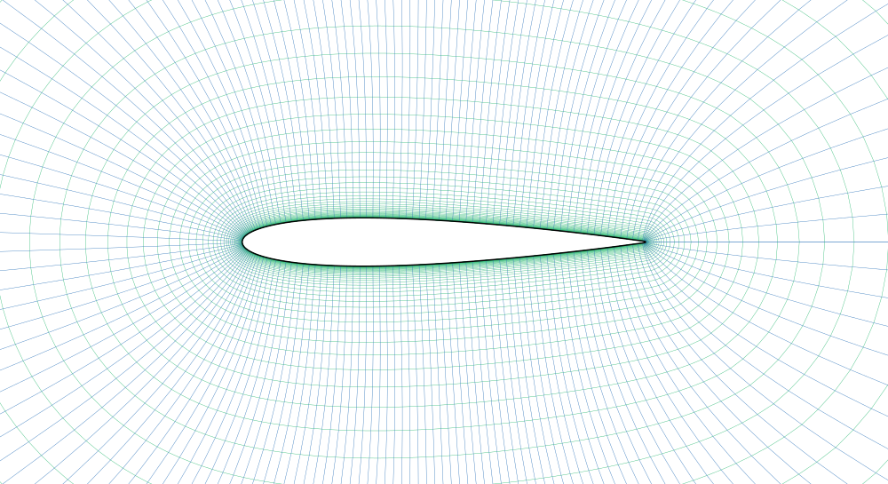

# Construct2D.jl

A **pure-Julia** structured grid generator for 2D airfoils — a port of Daniel
Prosser's [**Construct2D**](https://sourceforge.net/projects/construct2d/)
(GPL-3.0).

No Fortran toolchain, no external binary, no process I/O: `]add Construct2D` and
mesh an airfoil entirely in Julia, on any platform Julia runs on.

```julia
using Construct2D

# From a coordinate file (XFOIL/Selig labeled format) ...
res = mesh_airfoil("naca0012.dat")

# ... or from coordinates already in Julia, with custom options:
opts = GridOptions(jmax = 120, radi = 20.0, ypls = 0.8, recd = 3.0e6)
res  = mesh_airfoil((x, y); name = "myfoil", options = opts)

res.X              # imax×jmax matrix of node x-coordinates
res.Y              # imax×jmax matrix of node y-coordinates
res.wall_distance  # first-layer wall spacing implied by the y+ target
write_plot3d("myfoil.p3d", res.grid)   # export a Plot3D grid file
```

## How it works

[`mesh_airfoil`](src/Construct2D.jl) reads the airfoil, picks a topology from the
trailing-edge geometry, grows a structured grid outward from the surface with the
**hyperbolic** solver, and returns the node coordinates as Julia matrices.

- **Sharp (closed) trailing edge ⇒ C-grid.** `imax = nsrf + 2·nwke` (a wake cut is
  added on both sides).
- **Blunt (open) trailing edge ⇒ O-grid.** The TE is filleted with a B-spline
  (`nte + 1` added points); `imax = nsrf`.

`res.X[:, 1]` / `res.Y[:, 1]` is the airfoil surface row; `res.X[:, end]` is the
farfield boundary. The first off-wall spacing is set from a target y+ and chord
Reynolds number.

<p align="center"></p>

## Options

[`GridOptions`](src/options.jl) — every field defaults to `nothing`, meaning "use
Construct2D's geometry-aware default". Common knobs:

| field  | meaning                                                       |
|--------|---------------------------------------------------------------|
| `jmax` | points in the wall-normal direction (default 100)             |
| `radi` | farfield radius in chords (default 15)                        |
| `topo` | `"OGRD"` / `"CGRD"`; omit to use the recommended topology     |
| `slvr` | `"HYPR"` (hyperbolic, default). `"ELLP"` not yet ported       |
| `ypls` | target y+ for the first cell (with `recd`, the Reynolds no.)  |
| `recd` | chord Reynolds number used with `ypls` (default 1e6)          |
| `nwke` | wake points for the C-grid (default 50)                       |
| `nte`  | points inserted to fillet a blunt TE (default 13)             |
| `alfa`, `epsi`, `epse`, `funi`, `asmt` | hyperbolic solver controls    |

See `?GridOptions` for the full list.

## Examples

Runnable scripts in [`examples/`](examples):

- `01_basic_naca0012.jl` — mesh a file, inspect the result, write Plot3D.
- `02_options_and_coords.jl` — custom options, in-memory (sharp-TE) coordinates.
- `03_visualize_svg.jl` — render the mesh to a standalone SVG.

```bash
julia --project=. examples/01_basic_naca0012.jl
```

## Status

`v0.2` — pure-Julia rewrite. **Working:** the hyperbolic solver (`HYPR`, the
default) on both O- and C-grids, blunt-TE filleting, y+ wall spacing, Plot3D I/O.

**Not yet ported** (these fail loudly rather than produce a wrong grid):

- `surface = :smoothed` — XFOIL surface repaneling (`SMTH`). Use the default
  `:buffer` mode, which meshes the loaded geometry directly.
- `slvr = "ELLP"` — the elliptic solver.
- the `.nmf` boundary-condition writer and grid-quality statistics.

This is a faithful translation: each routine cites its upstream Fortran source
(`# <- src/<file>.f90 :: <routine>`), array indexing matches one-to-one (both
languages are 1-based and column-major), and the package mirrors the upstream
`src/` module layout.

## License

**GPL-3.0.** Construct2D.jl is a derivative work — a Julia port of Daniel
Prosser's GPL-3.0 [Construct2D](https://sourceforge.net/projects/construct2d/) —
so it carries the same license. All credit for the original program and its
grid-generation algorithms goes to Daniel Prosser. See [`LICENSE`](LICENSE) and
[`COPYING`](COPYING).
